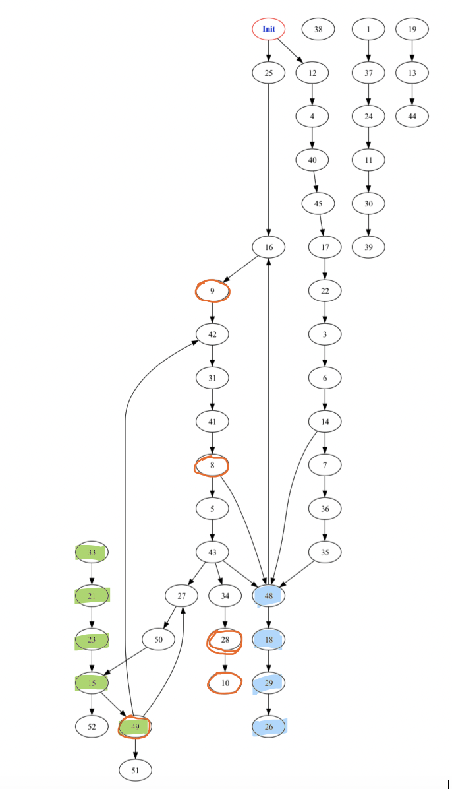

# CS441_Fall2023_HW3
## Swetha Gumpena
### UIN: 670605665
### NetID: sgumpe2@uic.edu

Repo for the Akka HTTP Homework-3 for CS441-Fall2023

---

AWS EC2 Deployment video link: 

---

## Environment:
**OS** : Mac OS

---

## Prerequisites:
- SBT
- Java 11

---

## Running the project
1) Download the repo from git
2) The root file is found in _src/main/scala/Main.scala_
3) Run `sbt clean compile` from the terminal
4) Run `sbt "run <input-path> <output-path>"` without the angular braces
5) Run `sbt test` to test
6) To create the jar file, run the command `sbt clean compile assembly`
7) The resulting jar file can be found at _target/scala-2.13/policeman_thief_graph_game.jar_
8) If you are running using IntelliJ, import the project into the IDE, build it and create a `configuration` for MainClass.scala. The arguments in this would be the input files (original graph, perturbed graph) and output folder separated by a space i.e., `<.ngs file of original graph> <.ngs file of perturbed graph> <output directory>`
- Configuration example - `inputs/NetGraph_14-11-23-23-38-44.ngs inputs/NetGraph_14-11-23-23-38-44.ngs.perturbed src/main/scala/resources/output`

- Make sure that your local input/output folder has the requisite permissions to allow the program to read and write to it

---

### Parameters
1. Sample input path - ```inputs/NetGraph_14-11-23-23-38-44.ngs inputs/NetGraph_14-11-23-23-38-44.ngs.perturbed```
2. Sample output path - ```src/main/scala/resources/output```

---

## Requirements:

In this homework, we have to construct HTTP requests and responses for playing the Policeman and Thief game and, implement the game server using microservices that receive these HTTP requests and reply to them using the rules of the P/T game. We will then deploy an instance of the game engine on AWS EC2 and configure it to enable clients to play the P/T game  
The game should be played by the following rules: 
1) Initially can place P and T at any random place. If coincidentally they end up being on the same node, game is over before even starting
2) Each player takes turns moving its corresponding P or T using directed edges between nodes. Some nodes have the attribute ValuableData and if T ends up at a node with this attribute then s/he wins the game and P loses the game 
3) If T is initially placed at the node with the valuable data then T wins by default and the game restarts
4) However, if P and T end up at the same node then P wins the game and T loses it
5) If either P or T end up at a node where there are no moves available then the stuck player with no available moves loses the game
6) P and T query the PG to obtain information about their own and the opponent's location nodes and the adjacent nodes. Each of these nodes comes with some confidence score that the node or the edges that lead to it were not perturbed
7) If a player makes a move in PG that cannot be performed in OG s/he loses the game in addition to the basic game rules

Other Requirements:

1) 5 or more scala tests should be implemented 
2) Logging used for all programs 
3) Configurable input and output paths for the program 
4) Compilable through sbt 
5) Deployed on AWS EC2

---

## Technical Design

We will take a look at the detailed description of how each of these pieces of code work below. Line by line comments explaining every step are also added to the source code in this git repo:

1) ### [Main.scala](src/main/scala/Main.scala)
    This is the main method that we call to run our application. It takes our input and output path. Our input comprises the .ngs file of original graph and .ngs file of perturbed graph generated by NetGraphSim.
- Load the original and perturbed graphs using a custom function _(LoadGraph.load)_ and get the nodes and edges
- With these nodes and edges construct mutable value graphs for original and perturbed graph using Guava's GraphBuilder
- Akka HTTP Setup:
  - Set up the necessary components for Akka HTTP, including an implicit ActorSystem, Materializer, and ExecutionContextExecutor
- Create GameActor:
  - Create a GameActor by matching the originalValueGraph and perturbedValueGraph.
  - If both graphs are present (Some(originalGraph), Some(perturbedGraph)), it creates a new GameActor with the graphs and an outputFilePath.
  - If either or both graphs are not present, it throws an IllegalStateException indicating a failure to create the gameActor.
- Create GameRoutes:
  - Create an instance of GameRoutes, passing the system and the created gameActor.
- Start Server Binding:
  It binds the gameRoutes to a server at port 8080
- Graceful Shutdown:
  - It waits for user input (scala.io.StdIn.readLine) to stop the server gracefully.
  - Upon receiving input, it unbinds the server and triggers the termination of the ActorSystem.

2) ### [LoadGraph.scala](src/main/scala/utils/LoadGraph.scala)
- The load function loads data from a specified file or URL. It expects a file path or URL as input and returns a tuple containing two lists: one with NodeObject instances and another with Action instances
- The function takes a single parameter filePath, which is a string representing the path to a file or a URL 
- It first checks if the filePath starts with either "http://" or "https://", indicating that it is a URL. 
  - If it is a URL, it attempts to open an input stream to read the data from the URL using new URL(filePath).openStream(). This operation is wrapped in a Try block to handle any potential exceptions
  - If it is not a URL, it assumes it is a file path. It attempts to open an input stream to read the data from the file using new FileInputStream(filePath). Again, this operation is wrapped in a Try block 
- The result of attempting to open the stream is stored in the inputStream variable, which is of type Option[InputStream]. This means it can either be Some(inputStream) if the stream was successfully opened or None if there was an error
- It returns a tuple (nodes, edges) containing the lists of nodes and edges 
- If inputStream is None, it means there was an error opening the stream. In this case, it throws an IllegalArgumentException with the message "Invalid file path or URL"

3) ### [GameRoutes.scala](src/main/scala/routes/GameRoutes.scala)
- This represents the routes for the Policeman/Thief game. It takes an implicit ExecutionContext and extends JsonSupport for JSON serialization/deserialization
- The routes value is defined using the Akka HTTP DSL. It specifies different routes for health checking, moving the police and thief, getting the game state, restarting the game, and enabling autoplay
- Health Check Route:
  - A route for health checking, responding with "Hello, Akka HTTP!" when accessed. This to check if the server is up and running
- State Route:
  - A route for retrieving the current state of the game
- Move Police / Move Thief Route:
  - Routes for moving the police and thief position to their respective successor nodes
- Restart Route:
  - Route for restarting the game
- Autoplay Route:
  - Route for autoPlay, handling asynchronous autoPlay game logic

- <ins>**Game autoplay**</ins> - Exposing an endpoint for automated client program that plays the game to its completion using a strategy
  - The very first time this endpoint is hit, it triggers the State route to get the initial state of the policeman and thief
  - Then, it triggers the move thief and move police alternatively until the game ends
  - Game ending rules are mentioned in detail in GameActor
  - Once the game ends, the game path and steps are written to a file
  - We then have to restart the game by hitting the Restart route to play again

4) ### [JsonSupport.scala](src/main/scala/utils/JsonSupport.scala)
- The JsonSupport trait is a utility trait in the application that simplifies the process of (de)serializing JSON data for communication between clients and the Akka HTTP server. It leverages Akka HTTP's SprayJsonSupport and DefaultJsonProtocol to define implicit JSON formats for specific case classes used in the game
- This ensures consistency in handling JSON representations of game-related messages, such as move results and game states, between the client and the server.

5) ### [GameActor.scala](src/main/scala/actors/GameActor.scala)
- The GameActor class extends the Akka Actor trait. It takes the original and perturbed graphs, along with an output file path, as constructor parameters
- We first define several case classes for different messages that can be sent to the actor:
  - MovePolice, MoveThief, GetState, RestartGame
  - MoveResult and StateResult as responses
  - GameResponse as a sealed trait for handling different response types
- Initially the police is given a random node in the perturbed graph to start from
- The thief is given the farthest node from the police to start from to reduce the possibility of both police and thief landing on the same node initially and ending the game at the very beginning
- **getFarthestNodeFrom** - 
  - This method calculates and returns the node in a graph that is farthest from a specified starting node using breadth-first search traversal
  - It considers both incoming and outgoing edges during the traversal and keeps track of visited nodes to avoid revisiting them
- **handleGetState** - 
  - GetState route triggers handleGetState
  - It sends the game over message if the game is already over
  - Otherwise, checks the game status and sends the current police and thief positions
- **handleMove** - 
  - MovePolice and MoveThief routes trigger handleMove with a flag indicating the mover
  - Checks if the game is over and sends the appropriate game over message
  - If the game is not over, it determines the current state based on the mover (police/thief)
  - Gets a perturbed successor for the current state (successor from the perturbed graph)
  - It then updates the state based on the successor and checks the game status
- **getSuccessor** -
  - This method finds the successor node with the highest <ins>Jaccard similarity</ins> in the perturbed graph, considering the corresponding nodes in the original graph
  - It uses randomness to break ties when multiple successors have the same similarity
  - The result is an Option[NodeObject] representing the best successor node 
- **checkGameStatus** -
  - Checks if the police has caught the thief or if the thief has reached valuable data
  - Sends appropriate game over messages with the winner and valuable node information
- **handleRestart** -
  - Resets game state variables for a new game and sends a message indicating that the game has been restarted
- **Game over scenarios** -
  - If the police and the thief land on the same node, Police catches the thief and the game is over
  - If thief lands on a node which has valuable data, then thief wins the game and the game is over
  - If the police or thief cannot move further i.e., there is no successor, then the respective person loses and the game is over
  - If the police or thief makes a move on the perturbed graph that does not exist in the original graph (in the case of added edges) then the respective person loses and the game is over

6) ### [SimilarityScore.scala](src/main/scala/utils/SimilarityScore.scala)
  - This function takes two NodeObject instances, perturbedNodeObject and originalNodeObject, as input 
  - It first converts both NodeObject instances into sets of integers using their toSet method 
  - It calculates the Jaccard Similarity between the sets, which is defined as the size of the intersection divided by the size of the union of the sets 
  - If the union size is 0 (indicating both sets are empty), it returns 0.0 to avoid division by zero errors. Otherwise, it returns the Jaccard Similarity

---

## Results
Sample results are shown below. 
```
Police is at 48, Thief is at 33.
Police is at 48, Thief is at 21.
Police is at 18, Thief is at 21.
Police is at 18, Thief is at 23.
Police is at 29, Thief is at 23.
Police is at 29, Thief is at 15.
Police is at 26, Thief is at 15.
Thief has reached valuable data at 49. Game over. Thief has won. Restart the game.
```

In the above scenario: Police starts at node 48 and thief starts at node 33 in the perturbed graph.  
Valuable data nodes are marked with an orange circle (8, 9, 10, 28, 49)
Thief reaches valuable data node 49 and wins the game


---

## Test Cases
These are run through the command `sbt test`

